# Rapport de Projet — Application de Digital Banking

**Module :** Développement Web JEE  
**Établissement :** ENSET Mohammedia, Université Hassan II de Casablanca  
**Année universitaire :** 2025-2026

---

## Table des matières

1. [Introduction](#1-introduction)
2. [Architecture globale](#2-architecture-globale)
3. [Technologies utilisées](#3-technologies-utilisées)
4. [Backend — Spring Boot](#4-backend--spring-boot)
5. [Frontend — Angular](#5-frontend--angular)
6. [Chatbot — RAG avec Telegram](#6-chatbot--rag-avec-telegram)
7. [Sécurité](#7-sécurité)
8. [Diagramme de classes (PlantUML)](#8-diagramme-de-classes-plantuml)
9. [Implémentation](#9-implémentation)
10. [Conclusion](#10-conclusion)

---

## 1. Introduction

Ce projet consiste en la réalisation d'une application web de digital banking complète, couvrant la gestion des clients, des comptes bancaires et des opérations financières. L'application est articulée autour de trois composants principaux : un backend RESTful développé avec Spring Boot 3, un frontend développé avec Angular 17+, et un service de chatbot intelligent intégrant une pipeline RAG (Retrieval-Augmented Generation) accessible via Telegram.

Le cas d'usage cible les fonctionnalités suivantes :

- Gestion des clients (CRUD complet avec recherche)
- Gestion des comptes bancaires (comptes courants et comptes épargne)
- Gestion des opérations : versements, retraits et virements
- Consultation de l'historique paginé des opérations
- Authentification stateless par JWT
- Assistance intelligente via chatbot RAG couplé à l'API bancaire

---

## 2. Architecture globale

L'application suit une architecture client-serveur à trois niveaux, avec un service chatbot indépendant :

```
Utilisateur (Web)
      │
      ▼
Angular 17+ (port 4200)
      │  HTTP/JSON + JWT
      ▼
Spring Boot Backend (port 8085)
  ├── REST Controllers
  ├── Service Layer
  ├── Repositories JPA
  └── MySQL Database

Utilisateur (Telegram)
      │
      ▼
Spring Boot Chatbot (port 8086)
  ├── Telegram Bot (long polling)
  ├── Intent Router (GPT-4o)
  ├── RAG Service (SimpleVectorStore + GPT-4o)
  ├── Banking API Client (WebClient → port 8085)
  └── Conversation Memory
```

Le backend et le chatbot sont deux projets Spring Boot distincts. Le chatbot s'authentifie auprès du backend via JWT et utilise ses endpoints REST pour accéder aux données bancaires en temps réel.

---

## 3. Technologies utilisées

### Backend

| Technologie       | Version | Rôle                                    |
| ----------------- | ------- | --------------------------------------- |
| Spring Boot       | 3.5.14  | Framework principal                     |
| Spring Web (MVC)  | —       | Exposition des endpoints REST           |
| Spring Data JPA   | —       | Accès aux données                       |
| Spring Security   | 6.x     | Authentification et autorisation        |
| Hibernate         | 6.x     | ORM, mapping objet-relationnel          |
| MySQL             | 8.x     | Base de données relationnelle           |
| JJWT              | 0.13.x  | Génération et validation des tokens JWT |
| Lombok            | —       | Réduction du code boilerplate           |
| SpringDoc OpenAPI | 2.x     | Documentation Swagger UI                |
| Java              | 21      | Langage de programmation                |

### Frontend

| Technologie     | Version | Rôle                    |
| --------------- | ------- | ----------------------- |
| Angular         | 21      | Framework frontend      |
| Bootstrap       | 5.x     | Framework CSS           |
| Bootstrap Icons | —       | Iconographie            |
| RxJS            | —       | Programmation réactive  |
| Angular Signals | —       | Gestion d'état réactive |

### Chatbot

| Technologie       | Version                | Rôle                             |
| ----------------- | ---------------------- | -------------------------------- |
| Spring Boot       | 3.5.14                 | Framework principal              |
| Spring AI         | 1.0.0                  | Intégration OpenAI, RAG pipeline |
| OpenAI GPT-4o     | —                      | Modèle de langage (LLM)          |
| OpenAI Embeddings | text-embedding-ada-002 | Vectorisation des documents      |
| SimpleVectorStore | —                      | Base vectorielle en mémoire      |
| TelegramBots SDK  | 8.2.x                  | Client Telegram (long polling)   |
| Spring WebFlux    | —                      | Client HTTP réactif (WebClient)  |

---

## 4. Backend — Spring Boot

### 4.1 Structure du projet

```
ebanking-backend/
 ├── entities/
 │    ├── BankAccount.java       (SINGLE_TABLE)
 │    ├── CurrentAccount.java
 │    ├── SavingAccount.java
 │    ├── Customer.java
 │    └── AccountOperation.java
 ├── enums/
 │    ├── AccountStatus.java     (CREATED, ACTIVATED, SUSPENDED)
 │    └── OperationType.java     (DEBIT, CREDIT)
 ├── dtos/
 │    ├── CustomerDTO.java
 │    ├── BankAccountDTO.java
 │    ├── CurrentBankAccountDTO.java
 │    ├── SavingBankAccountDTO.java
 │    ├── AccountOperationDTO.java
 │    ├── AccountHistoryDTO.java
 │    ├── DebitDTO.java
 │    ├── CreditDTO.java
 │    └── TransferRequestDTO.java
 ├── mappers/
 │    └── BankAccountMapper.java
 ├── repositories/
 │    ├── CustomerRepository.java
 │    ├── BankAccountRepository.java
 │    └── AccountOperationRepository.java
 ├── services/
 │    ├── BankAccountService.java       (interface)
 │    └── BankAccountServiceImpl.java
 ├── web/
 │    ├── CustomerRestController.java
 │    ├── BankAccountRestController.java
 │    ├── AuthController.java
 │    └── GlobalExceptionHandler.java
 ├── exceptions/
 │    ├── CustomerNotFoundException.java
 │    ├── BankAccountNotFoundException.java
 │    └── BalanceNotSufficientException.java
 └── security/
      ├── SecurityConfig.java
      ├── JwtUtils.java
      ├── JwtAuthenticationFilter.java
      └── UserDetailsServiceImpl.java
```

### 4.2 Modèle de données

Le modèle de domaine repose sur une hiérarchie de comptes bancaires stockée dans une seule table grâce à la stratégie `SINGLE_TABLE` de JPA, discriminée par une colonne `TYPE` (`CA` pour compte courant, `SA` pour compte épargne).

Chaque client possède un ou plusieurs comptes, et chaque compte est associé à une liste d'opérations. Les opérations de type `DEBIT` ou `CREDIT` sont horodatées et décrivent chaque mouvement financier.

### 4.3 Couche service

La couche service implémente l'ensemble de la logique métier :

- Création et mise à jour des clients
- Ouverture de comptes courants (avec découvert) et de comptes épargne (avec taux d'intérêt)
- Exécution des opérations de débit, crédit et virement
- Consultation de l'historique paginé des opérations
- Recherche de clients par mot-clé

### 4.4 API REST

L'ensemble des endpoints est préfixé par `/api` et documenté via Swagger UI accessible à l'adresse `http://localhost:8085/swagger-ui.html`.

| Méthode | Endpoint                            | Description                        |
| ------- | ----------------------------------- | ---------------------------------- |
| GET     | `/api/customers`                    | Liste des clients                  |
| GET     | `/api/customers/search?keyword=`    | Recherche de clients               |
| GET     | `/api/customers/{id}`               | Détails d'un client                |
| POST    | `/api/customers`                    | Création d'un client               |
| PUT     | `/api/customers/{id}`               | Mise à jour d'un client            |
| DELETE  | `/api/customers/{id}`               | Suppression d'un client            |
| GET     | `/api/accounts`                     | Liste des comptes                  |
| GET     | `/api/accounts/{id}`                | Détails d'un compte                |
| GET     | `/api/customers/{id}/accounts`      | Comptes d'un client                |
| POST    | `/api/accounts/current`             | Création d'un compte courant       |
| POST    | `/api/accounts/saving`              | Création d'un compte épargne       |
| POST    | `/api/accounts/debit`               | Opération de débit                 |
| POST    | `/api/accounts/credit`              | Opération de crédit                |
| POST    | `/api/accounts/transfer`            | Virement entre comptes             |
| GET     | `/api/accounts/{id}/operations`     | Historique complet                 |
| GET     | `/api/accounts/{id}/pageOperations` | Historique paginé                  |
| POST    | `/api/auth/login`                   | Authentification (retourne un JWT) |

---

## 5. Frontend — Angular

### 5.1 Structure du projet

```
ebanking-frontend/
 ├── environments/
 │    ├── environment.ts          (apiUrl: localhost:8085/api)
 │    └── environment.prod.ts
 ├── models/
 │    ├── auth.model.ts
 │    ├── customer.model.ts
 │    └── account.model.ts
 ├── services/
 │    ├── auth.service.ts         (signal<AppUser>)
 │    ├── customer.service.ts
 │    └── account.service.ts
 ├── interceptors/
 │    └── auth.interceptor.ts     (HttpInterceptorFn)
 ├── guards/
 │    ├── auth.guard.ts
 │    └── admin.guard.ts
 └── components/
      ├── navbar/
      ├── login/
      ├── customers/              (liste + recherche live)
      ├── customer-form/          (création + édition)
      └── accounts/               (détails + opérations + historique paginé)
```

### 5.2 Fonctionnalités implémentées

L'application Angular repose exclusivement sur des **composants standalone** (sans NgModule), du **lazy loading** sur toutes les routes, et des **Angular Signals** pour la gestion d'état de l'utilisateur connecté.

- **Page de login** : formulaire réactif avec validation, gestion des erreurs, persistance du token en `localStorage`.
- **Navbar** : affichage conditionnel selon le rôle (`ROLE_ADMIN` / `ROLE_USER`), bouton de déconnexion.
- **Liste des clients** : tableau Bootstrap, recherche live avec `debounceTime` et `switchMap`, suppression avec confirmation.
- **Formulaire client** : mode création et édition (route `/customers/new` et `/customers/edit/:id`), validation de formulaire.
- **Page comptes** : recherche par identifiant de compte, affichage des détails, formulaire d'opération (débit / crédit / virement), historique paginé avec navigation.

### 5.3 Sécurité côté frontend

Un intercepteur HTTP fonctionnel (`HttpInterceptorFn`) injecte automatiquement le token JWT dans l'en-tête `Authorization: Bearer ...` de chaque requête. Deux guards protègent les routes : `authGuard` vérifie la présence d'un token valide, `adminGuard` vérifie le rôle administrateur.

---

## 6. Chatbot — RAG avec Telegram

### 6.1 Architecture du chatbot

```
ebanking-chatbot/
 ├── config/
 │    ├── OpenAiConfig.java       (ChatClient, SimpleVectorStore)
 │    └── WebClientConfig.java
 ├── rag/
 │    ├── DocumentIngestionService.java   (@PostConstruct)
 │    ├── RagService.java                 (RAG + direct GPT-4o)
 │    └── ConversationMemory.java         (historique par chatId)
 ├── banking/
 │    ├── BankingApiClient.java           (WebClient → backend)
 │    └── BankingApiModels.java           (DTOs de l'API)
 └── bot/
      ├── IntentRouter.java               (classification GPT-4o)
      └── TelegramBot.java                (SpringLongPollingBot)
```

### 6.2 Pipeline RAG

Au démarrage de l'application, le service `DocumentIngestionService` lit le fichier `banking-faq.txt`, le découpe en chunks via `TokenTextSplitter`, vectorise chaque chunk via l'API OpenAI Embeddings, et stocke les vecteurs dans un `SimpleVectorStore` en mémoire.

À chaque question d'un utilisateur :

1. La question est vectorisée.
2. Les chunks les plus proches sémantiquement sont récupérés (top-K avec seuil de similarité).
3. Ces chunks sont injectés comme contexte dans le prompt envoyé à GPT-4o.
4. La réponse générée est retournée à l'utilisateur via Telegram.

L'historique de conversation est maintenu par utilisateur (identifié par son `chatId` Telegram) dans un `ConcurrentHashMap`, limité aux 10 derniers échanges pour éviter de dépasser la fenêtre de contexte du modèle.

### 6.3 Routage des intentions

Le composant `IntentRouter` soumet chaque message utilisateur à GPT-4o avec un prompt de classification. Le modèle retourne une intention parmi :

`GREETING`, `FAQ`, `LIST_CUSTOMERS`, `SEARCH_CUSTOMER`, `LIST_ACCOUNTS`, `GET_ACCOUNT`, `GET_HISTORY`, `DEBIT`, `CREDIT`, `TRANSFER`, `CLEAR_HISTORY`, `UNKNOWN`

Selon l'intention détectée, le bot exécute l'action correspondante : appel RAG, appel API bancaire, ou opération financière.

### 6.4 Commandes Telegram disponibles

| Commande     | Description                               |
| ------------ | ----------------------------------------- |
| `/start`     | Message de bienvenue                      |
| `/customers` | Liste de tous les clients                 |
| `/accounts`  | Liste de tous les comptes                 |
| `/help`      | Affiche le menu d'aide                    |
| `/clear`     | Réinitialise l'historique de conversation |

En dehors des commandes, le bot accepte des requêtes en langage naturel comme :

- _"Quel est le solde du compte X ?"_
- _"Débiter 500 MAD du compte X"_
- _"Virer 1000 MAD du compte X vers le compte Y"_
- _"Quels sont les frais de virement ?"_

---

## 7. Sécurité

L'authentification est implémentée de façon **stateless** avec Spring Security 6 et JJWT 0.12.x. Les points clés :

- Aucune session HTTP n'est créée côté serveur (`SessionCreationPolicy.STATELESS`).
- Chaque requête doit porter un token JWT valide dans l'en-tête `Authorization`.
- Le token est signé avec HMAC-SHA256 et expire après 24 heures.
- Le filtre `JwtAuthenticationFilter` (implémentant `OncePerRequestFilter`) intercepte chaque requête, valide le token, et alimente le `SecurityContextHolder`.
- Les routes publiques (`/api/auth/**`, `/swagger-ui/**`, `/v3/api-docs/**`) sont exemptées d'authentification.
- L'annotation `@EnableMethodSecurity` permet un contrôle fin des autorisations par rôle via `@PreAuthorize`.
- Les secrets sensibles (clé JWT, token Telegram, clé OpenAI) sont référencés via des variables d'environnement, jamais codés en dur.

---

## 8. Diagrammes de classes

### 8.1 Classes Core

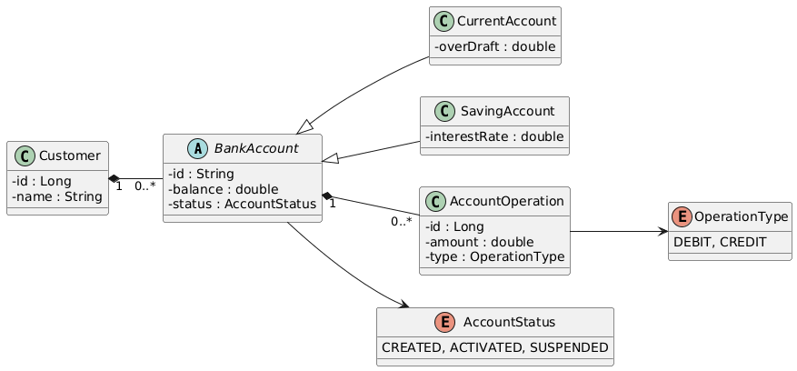

### 8.2 Classes de services

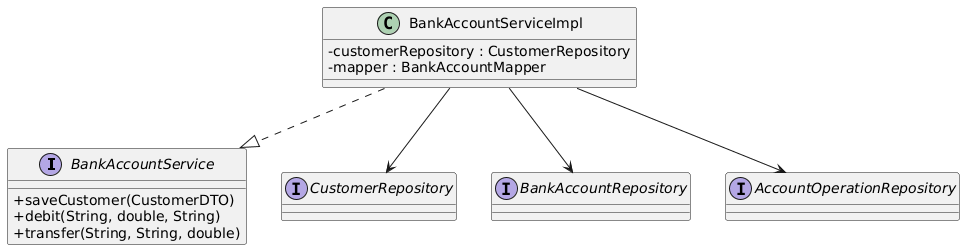

### 8.3 Classes de Couche Web

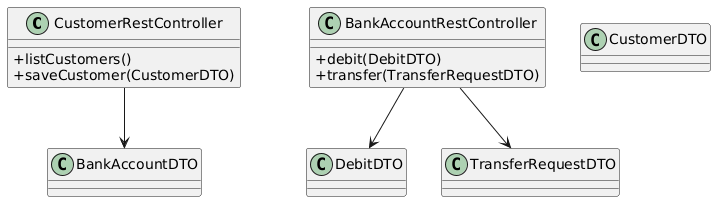

### 8.4 Classes de ChatBot

## 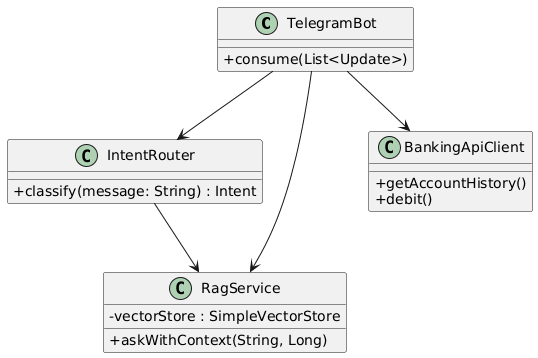

## 9. Implémentation

### 9.1 Swagger UI

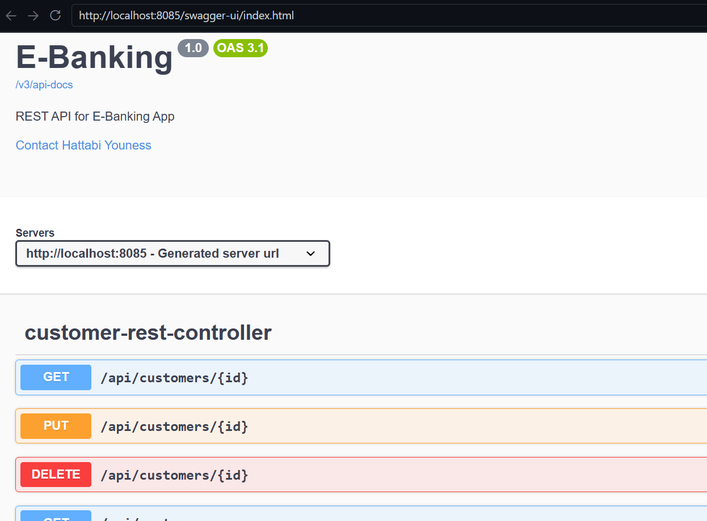

### 9.2 Interface Angular

#### 9.2.1 Login

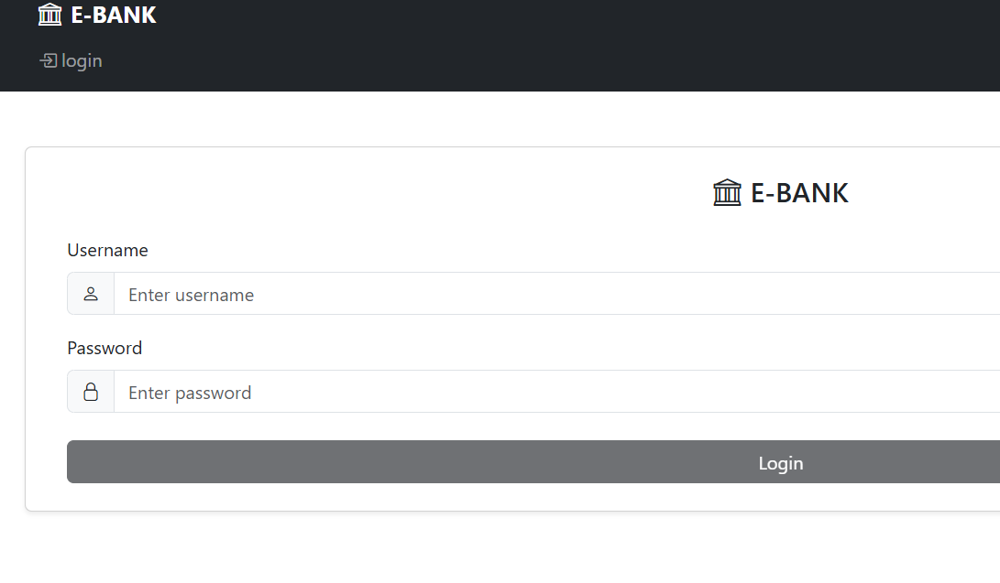

#### 9.2.2 Utilisateurs

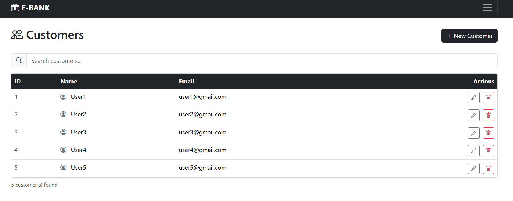

#### 9.2.3 Comptes

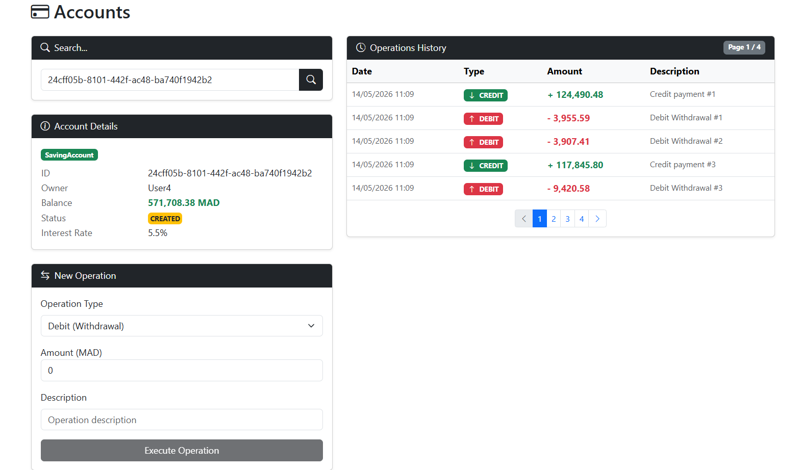

### 9.3 Telegram Bot

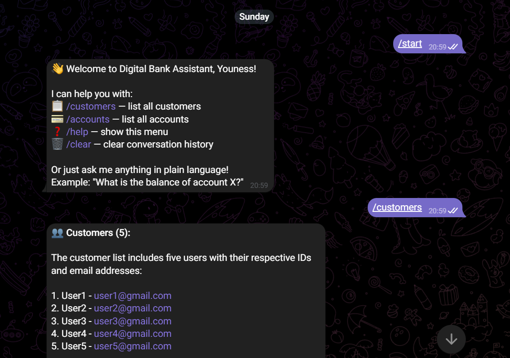

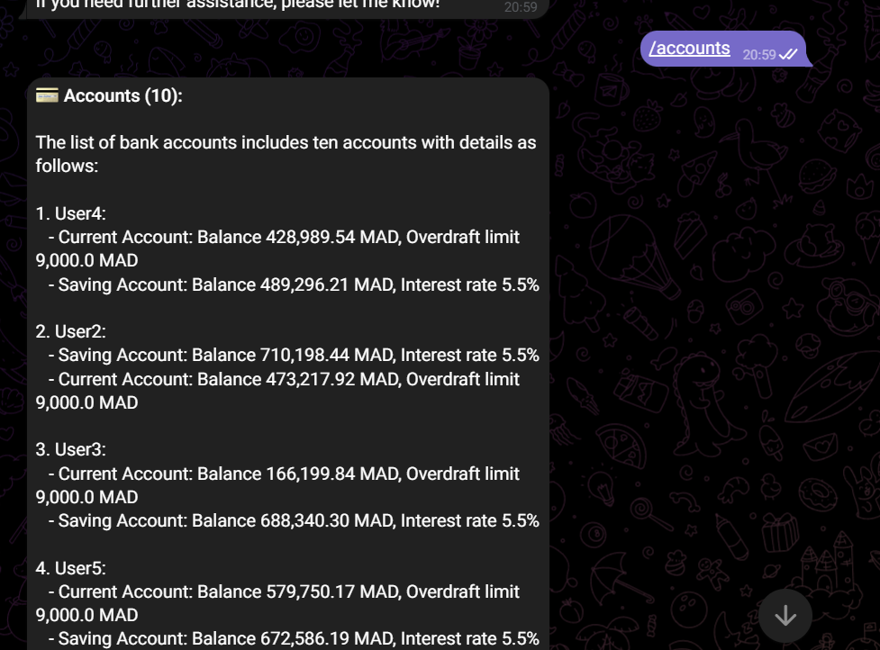

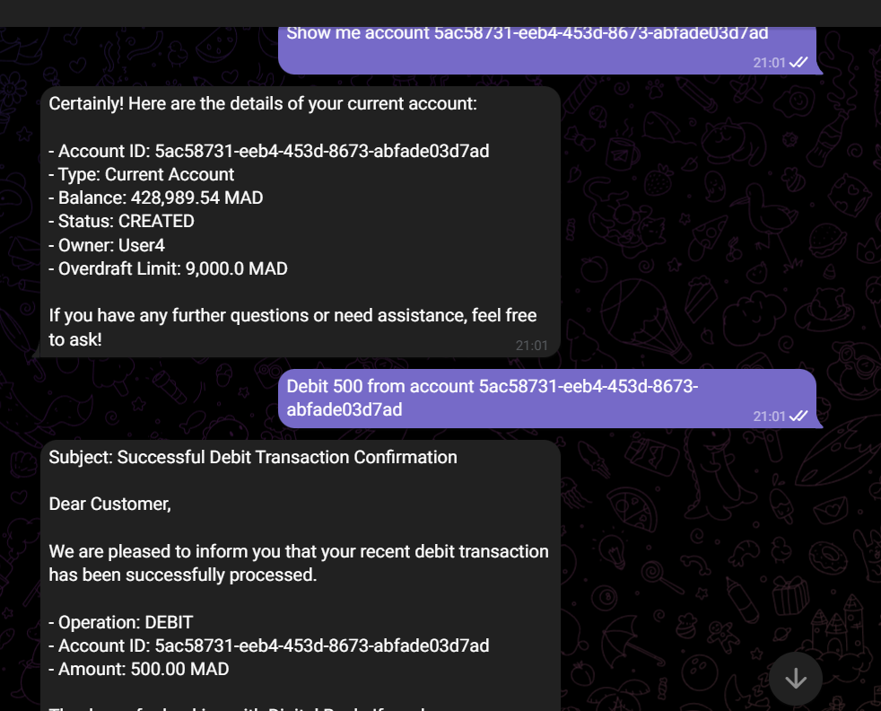

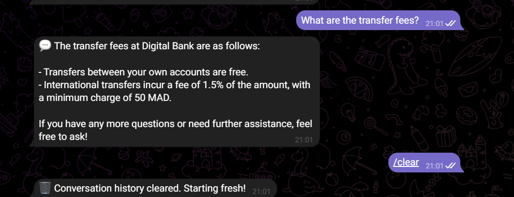

---

## 10. Conclusion

Ce projet a permis de mettre en œuvre une application web bancaire complète en suivant les bonnes pratiques de développement Java EE moderne :

- **Séparation des responsabilités** : chaque couche (entités, repositories, services, contrôleurs, DTOs) a un rôle clairement défini.
- **Sécurité stateless** : Spring Security 6 avec JWT 0.12.x, sans session serveur.
- **Frontend moderne** : Angular 17+ avec composants standalone, lazy loading, signals et intercepteurs fonctionnels.
- **IA générative intégrée** : pipeline RAG avec Spring AI 1.0.0, OpenAI GPT-4o et un vector store en mémoire.
- **Chatbot opérationnel** : le bot Telegram peut répondre à des questions en langage naturel, consulter les données bancaires en temps réel et exécuter des opérations financières.

Les principales améliorations apportées par rapport au projet initial du cours portent sur la modernisation de la stack (Jakarta EE, Spring Security 6, Angular standalone, JJWT 0.12.x), l'ajout de DTOs dédiés aux opérations, la gestion globale des erreurs, et l'intégration d'un chatbot RAG entièrement développé en Java avec Spring AI.
